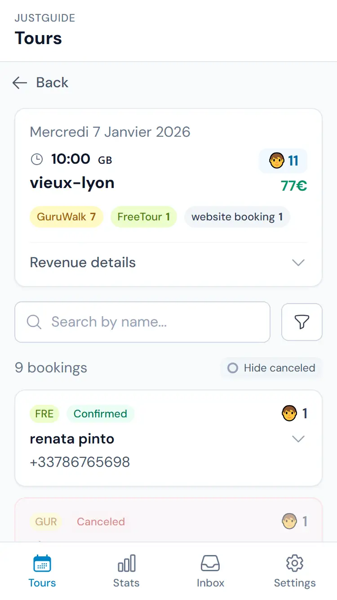

# JustGuide Marketing Website

A clean, SEO-optimized marketing landing page for JustGuide — the booking aggregation tool for tour guides and agencies.

## 🚀 Quick Start

### Option 1: Open directly
Simply open `index.html` in your browser.

### Option 2: Local development server
```bash
# Using Python (built-in)
python -m http.server 8080

# Using Node.js (npx)
npx serve

# Using PHP
php -S localhost:8080
```

Then visit `http://localhost:8080`

## 📁 Project Structure

```
justguide-marketing/
├── index.html              # Main landing page
├── styles/
│   ├── main.css            # All styles
│   └── variables.css       # CSS custom properties
├── scripts/
│   └── main.js             # Minimal JS (nav, scroll, tracking)
├── assets/
│   ├── logo.svg            # JustGuide logo
│   ├── og-image.svg        # Open Graph image (convert to PNG for production)
│   └── screenshots/        # Product screenshots folder
│       └── .gitkeep
├── public/
│   └── favicon.svg         # Favicon
└── README.md               # This file
```

## 🎨 Customization

### Changing Colors
Edit `styles/variables.css` to update the color palette:

```css
:root {
  --primary: #0284c7;        /* Main blue */
  --primary-light: #0ea5e9;  /* Light blue */
  --primary-dark: #0369a1;   /* Dark blue */
  --accent: #f59e0b;         /* Amber (CTAs) */
  /* ... */
}
```

### Updating SEO Text
All SEO metadata is at the top of `index.html`:

```html
<title>Your Title Here</title>
<meta name="description" content="Your description here">
<meta property="og:title" content="Your OG title">
<!-- etc. -->
```

### Changing App URL and Contact Email
Edit the `CONFIG` object at the top of `scripts/main.js`:

```javascript
const CONFIG = {
  APP_URL: 'https://app.justguide.app',
  CONTACT_EMAIL: 'hello@justguide.app',
};
```

## 🖼️ Adding Screenshots

1. Take screenshots of your app (recommended: iPhone 14 Pro dimensions: 390×844)
2. Convert to WebP format for best performance
3. Place in `assets/screenshots/`:
   - `booking-list.webp`
   - `statistics.webp`
   - `auto-message.webp`

4. Uncomment the image tags in `index.html` (search for "Replace with actual screenshot"):

```html
<!-- Before -->
<div class="screenshot-card__placeholder">...</div>

<!-- After -->

```

## 📊 Adding Google Tag Manager

1. Create a GTM container at [tagmanager.google.com](https://tagmanager.google.com)
2. Get your container ID (format: `GTM-XXXXXXX`)
3. In `index.html`, find and uncomment the GTM sections:

**In `<head>`:**
```html
<script>(function(w,d,s,l,i){w[l]=w[l]||[];w[l].push({'gtm.start':
new Date().getTime(),event:'gtm.js'});var f=d.getElementsByTagName(s)[0],
j=d.createElement(s),dl=l!='dataLayer'?'&l='+l:'';j.async=true;j.src=
'https://www.googletagmanager.com/gtm.js?id='+i+dl;f.parentNode.insertBefore(j,f);
})(window,document,'script','dataLayer','GTM-XXXXXXX');</script>
```

**After `<body>`:**
```html
<noscript><iframe src="https://www.googletagmanager.com/ns.html?id=GTM-XXXXXXX"
height="0" width="0" style="display:none;visibility:hidden"></iframe></noscript>
```

4. Replace `GTM-XXXXXXX` with your container ID

### CTA Tracking

All CTAs have `data-cta` attributes for easy tracking:

| Attribute | Location |
|-----------|----------|
| `data-cta="signin"` | Sign in buttons |
| `data-cta="signup"` | Sign up buttons |

The JavaScript automatically pushes events to `dataLayer` when clicked:

```javascript
{
  event: 'cta_click',
  cta_name: 'signin',
  cta_text: 'Sign in',
  cta_url: 'https://app.justguide.app'
}
```

Create a GTM trigger for `cta_click` events to track conversions.

## 🚀 Deployment

### Firebase Hosting

1. Install Firebase CLI:
```bash
npm install -g firebase-tools
```

2. Login and initialize:
```bash
firebase login
firebase init hosting
```

3. When prompted:
   - **Public directory:** `.` (current directory)
   - **Single-page app:** No
   - **Overwrite index.html:** No

4. Deploy:
```bash
firebase deploy
```

### Netlify

**Option A: Drag & drop**
1. Go to [app.netlify.com](https://app.netlify.com)
2. Drag the project folder to deploy

**Option B: Git integration**
1. Push to GitHub/GitLab
2. Connect repository in Netlify
3. Build command: (leave empty)
4. Publish directory: `.`

### Vercel

```bash
npm install -g vercel
vercel
```

### GitHub Pages

1. Push to GitHub
2. Go to Settings → Pages
3. Source: Deploy from a branch
4. Branch: `main` / `(root)`

## ✅ SEO Checklist

- [x] Single H1 tag (hero headline)
- [x] Semantic HTML structure
- [x] Meta title and description
- [x] Canonical URL
- [x] Open Graph meta tags
- [x] Twitter Card meta tags
- [x] JSON-LD structured data (Organization, WebSite, SoftwareApplication)
- [x] Accessible alt texts
- [x] Mobile-responsive design
- [x] Fast loading (no heavy dependencies)

## ⚡ Performance Features

- **No frameworks** — Pure HTML/CSS/JS
- **Minimal JavaScript** — ~3KB minified
- **Font optimization** — Preconnect + display swap
- **Lazy loading** — Images load on scroll
- **CSS variables** — Single source of truth
- **Reduced motion** — Respects user preferences

## 🔧 Browser Support

- Chrome 88+
- Firefox 78+
- Safari 14+
- Edge 88+

Uses modern CSS features like:
- CSS custom properties
- `aspect-ratio`
- `gap` in flexbox
- `backdrop-filter`

## 📝 License

© 2026 JustGuide. All rights reserved.

---

**Questions?** Contact [hello@justguide.app](mailto:hello@justguide.app)
